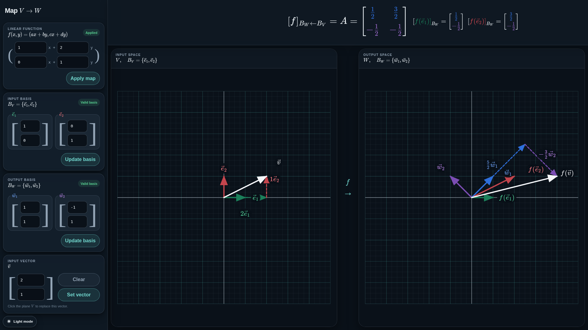

# Linear Map $V \to W$ Explorer

> **Access here:** [Linear Map V to W Explorer](https://rayleighlord.github.io/MapFromVtoW/)

An interactive browser-based explorer for choosing a linear map
$f(x,y)=(ax+by,cx+dy)$, independent bases $B_V$ and
$B_W$, and an input vector $\vec v$. It plots $\vec v$ and $f(\vec v)$
with their basis decompositions on linked $V$ and $W$ planes while computing exactly

